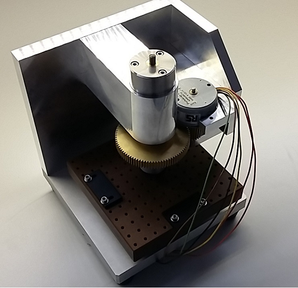

# Valve demo
--------------
## General
* Customer: Melexis
* Product(s): MLX81330, MLX81332, MLX90395
* Description: Stepper and BLDC actuators, positioning, 8-16V, LIN2.2
* Option(s): DEBUG, PLOT, PRINTF, LINAA, MLX90395

## Hardware setup

* Using MLX81330/32 EVB QFN24 V1.0
* solder R6 R7 0R
* remove R3 R4 R5
* connect stepper to CON3: T, U, V, W



<table>
  <tr><th>Motor</th><th>MLX81332</th><th>Function</th></tr>
  <tr><td>Yellow (1-2)</td><td>MLX81332-2</td><td>T</td></tr>
  <tr><td>Orange (2-1)</td><td>MLX81332-3</td><td>W</td></tr>
  <tr><td>Brown  (3-4)</td><td>MLX81332-5</td><td>U</td></tr>
  <tr><td>Black  (4-3)</td><td>MLX81332-4</td><td>V</td></tr>
</table>

## Getting started

* Build application
```sh
$ make clean
$ make all
```

## Continuous Integration
Gitlab-CI build status :
- Master branch 
- Develop branch 

## License
Copyright (C) 2019-2022 Melexis N.V.

The Software is being delivered 'AS IS' and Melexis, whether explicitly or implicitly, makes no warranty as to its Use or performance.
The user accepts the Melexis Firmware License Agreement.

Melexis confidential & proprietary
